# 📋 Giải Thích Các Khối Trong Sơ Đồ Schematic và PCB Layout

---

## 🏗️ Tổng Quan Cấu Trúc PCB 4 Lớp

| Lớp | Tên | Chức năng |
|-----|-----|-----------|
| **Lớp 1** | Top | Lắp các linh kiện chính: Module ESP32-S3, Antenna, Mic, USB-C, ... |
| **Lớp 2** | GND Plane | Đổ full đồng làm mặt phẳng GND |
| **Lớp 3** | Power/Signal | Đi các đường nguồn (3V3, 5V, 1V8, 1V5) và tín hiệu (EN, ...) |
| **Lớp 4** | Bottom | Linh kiện phụ và linh kiện lớn: FPC Connector, LDO 2V8, LDO 1V8 |

---

## 1. 🔌 Khối USB-C (Nạp Code & Cấp Nguồn)

### Schematic

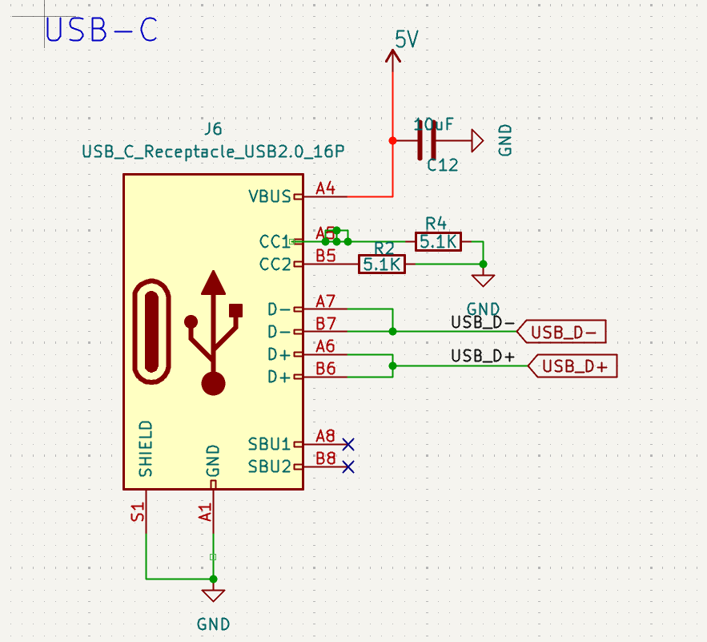

### Mô tả

Em sử dụng **USB-C 16P** với các kết nối:

- **Chân CC1 và CC2**: Dùng 2 điện trở **5.1kΩ** kéo xuống GND
- **Chân SHIELD**: Nối thẳng xuống GND

### Layout

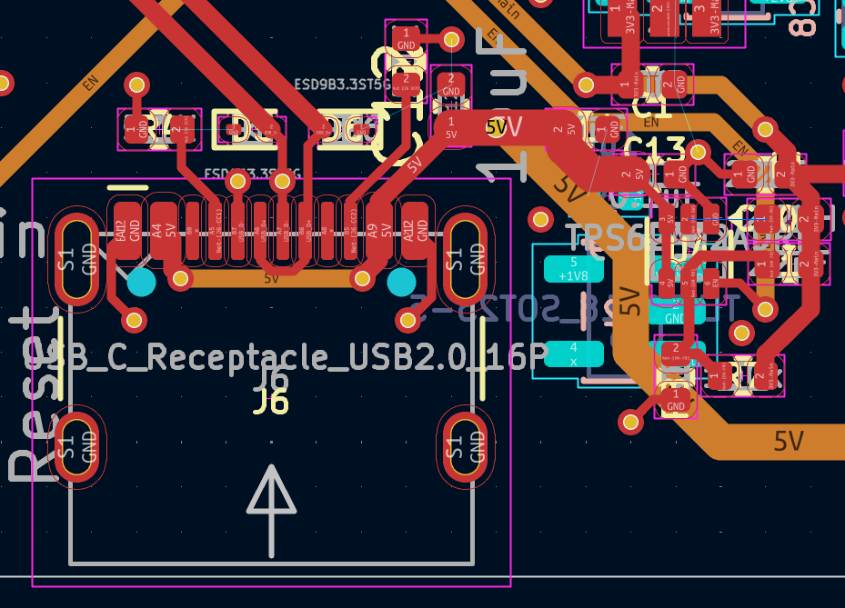

#### Chi tiết thiết kế:

- Nối 2 chân **B7** và **A7** lại với nhau thông qua **via Through**
- Dây **D-** và **D+** đi qua:
  1. **ESD9B3.3ST5G** (ESD Protection Diode)
  2. **DLW21SN900SQ2L** (Common Mode Choke) để lọc nhiễu
  3. Cuối cùng đi tới ESP32-S3

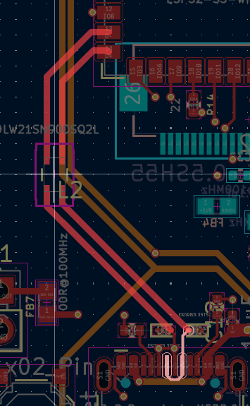

- 2 pad **5V** được nối lại với nhau thông qua via through, đi qua tụ bulk **10µF (C12)** trước khi đi tới khối Buck

> **❓ Câu hỏi:**
> 1. Cách nối B7, A7 lại với nhau thông qua via Through có đúng không ạ ?
> 2. Cách dùng ESD protection diode ESD9B3.3ST5G có đúng không ạ ?
> 3. Cách đi dây đã ổn chưa ạ ?

---

## 2. ⚡ Khối Buck Converter (5V → 3V3)

### Schematic & Layout

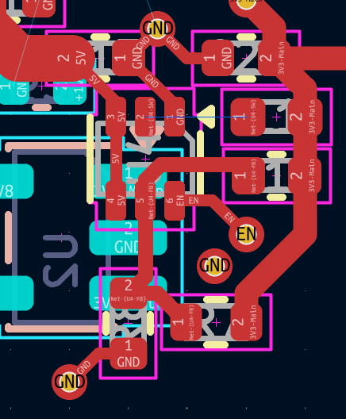
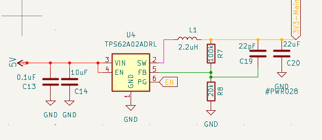

### Mô tả

- Sử dụng **2 tụ decoupling** ngay sát chân 5V để đón dòng vào Buck
- Đầu ra sử dụng **mạch chia áp** để nhận được 3V3

### LDO 1V8 (Lớp 4 - Bottom)

Ở bên dưới Buck (lớp 4), đặt **LDO 1V8** để:
- Đón dòng 3V3 và chuyển thành 1V8
- Cấp nguồn cho chân **DOVDD** của FPC Connector

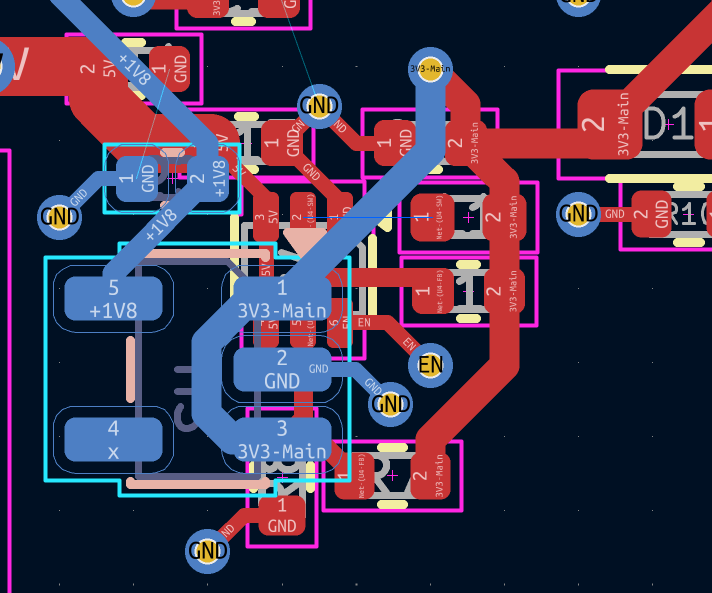
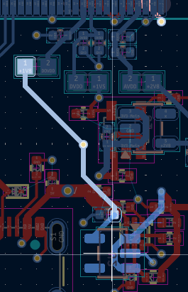

### Điều khiển Power Good (PG)

Sử dụng chân **PG** của Buck để điều khiển chân **EN** của ESP32-S3:
- Mục đích: Khi dòng 3V3 ổn định thì module mới khởi động

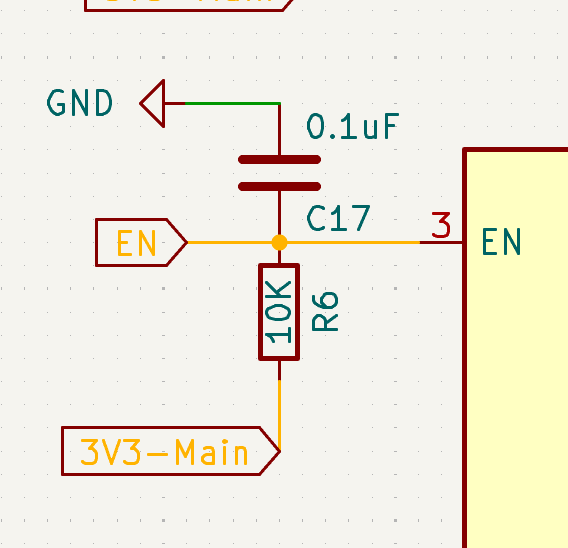
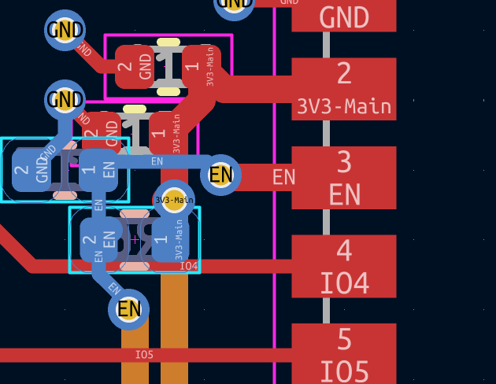

> *Mạch màu xanh: Chân PG kết nối vào chân EN của ESP32 để khởi động*

### Cấp nguồn cho ESP32-S3

- Cấp nguồn **3V3** từ Buck
- Sử dụng **2 tụ decoupling** sát chân 3V3 của module

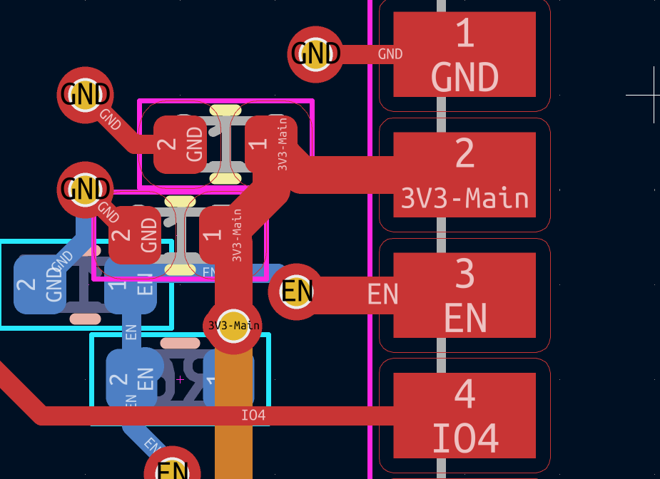

---

## 3. 🔋 Khối LDO

### Bố trí

| LDO | Vị trí | Chức năng |
|-----|--------|-----------|
| **3V3 → 1V5** | Lớp 1 (Top) | Cấp nguồn DVDD cho Camera |
| **3V3 → 2V8** | Lớp 4 (Bottom) | Cấp nguồn AVDD cho Camera |

> Cả 2 khối LDO được đặt **gần FPC Connector** để giảm độ dài đường dây nguồn.

### Schematic & Layout

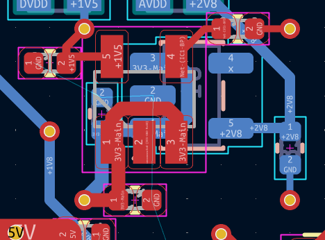
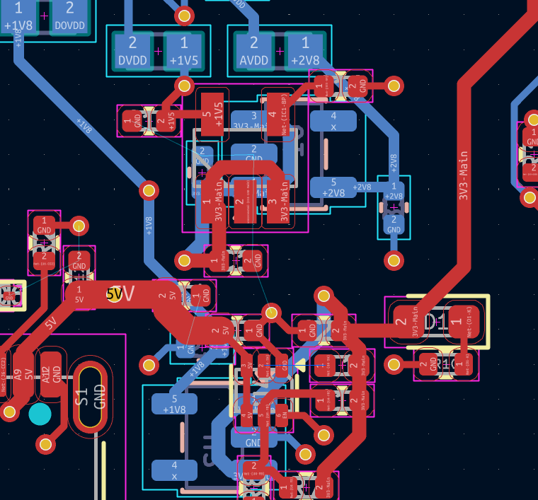
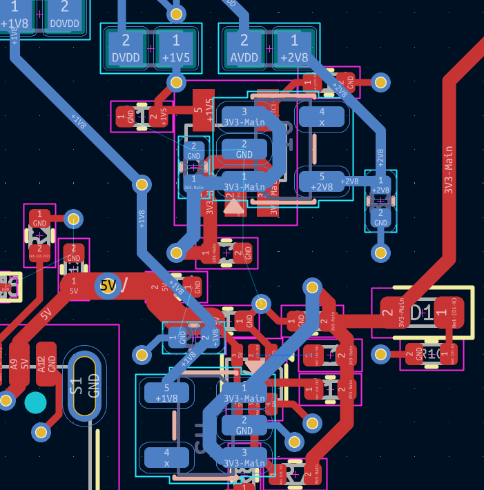
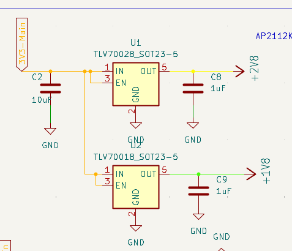
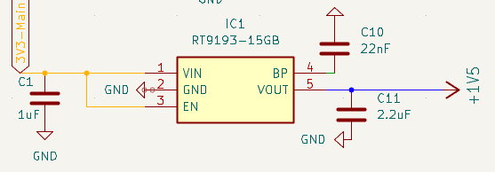

---

## 4. 📷 Khối FPC Connector (Camera)

### Schematic

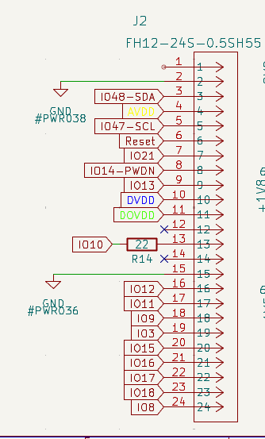
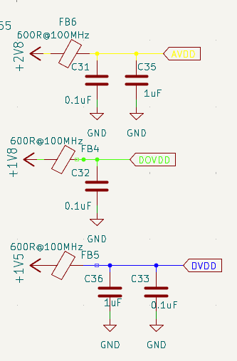
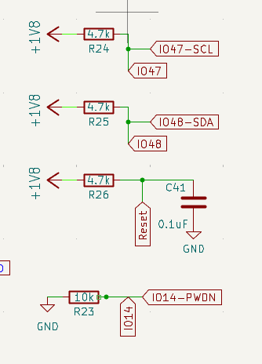

### Mô tả

Khối FPC Connector kết nối **camera OV2640** với ESP32-S3:
- Đặt **gần ESP32-S3** để giảm nhiễu và giảm độ dài dây kết nối

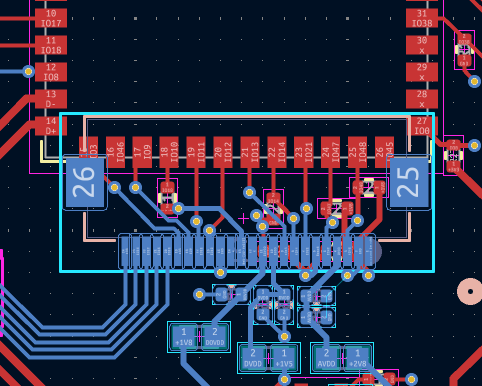

### Thiết kế chi tiết

| Thành phần | Thiết kế |
|------------|----------|
| **Ferrite Bead** | Giảm nhiễu cho các chân nguồn của FPC |
| **AVDD (2V8)** | Ferrite Bead BEADC1608X95N 600R@100MHz + 2 tụ decoupling (0.1µF, 1µF) |
| **DOVDD (1V8)** | Tương tự AVDD |
| **DVDD (1V5)** | Tương tự AVDD |
| **MCLK** | GPIO 10 của ESP32-S3 cấp clock |
| **SDA/SCL** | Mạch pull-up kết hợp GPIO 47, GPIO 48 |
| **RESET** | Mạch RC để reset sạch, ổn định |
| **PWDN** | Mạch pull-down |

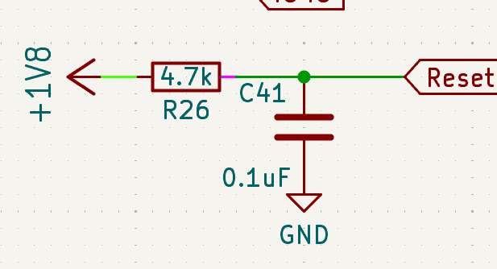
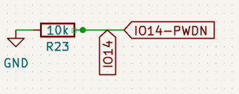

---

## 5. 🔊 Khối Audio Amplifier (AMP)

### Bố trí

- Đặt **gần mép board**, cách xa LDO và FPC để tránh nhiễu
- 3 dây **DIN, BCLK, LRCLK** đi song song, thẳng

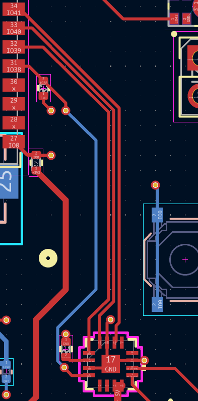

### Thiết kế chi tiết

| Chân | Thiết kế |
|------|----------|
| **SD_MODE** | Mạch pull-down + GPIO38 điều khiển |
| **VDD** | Ferrite Bead giảm nhiễu + 2 tụ decoupling |
| **OUTP/OUTN** | 2 tụ trên đường dây tín hiệu xuất ra → Header Pin → Loa |

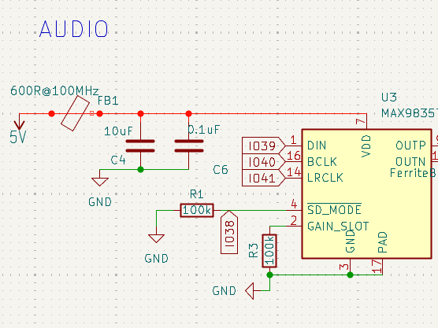
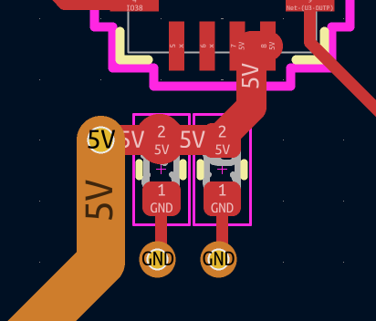
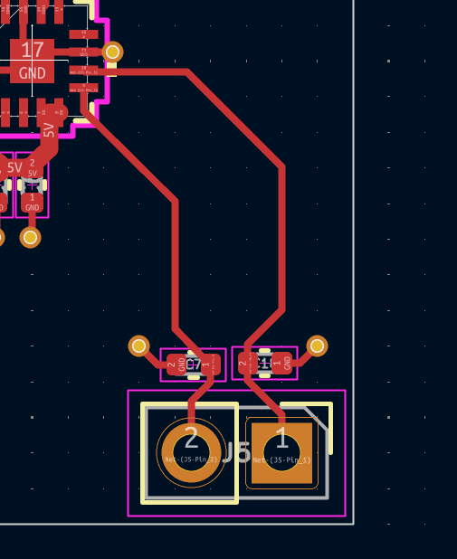

> ⚠️ *Em đã sửa lại mạch: Xóa các Ferrite Bead sau chân OUTP/OUTN, chỉ dùng tụ*

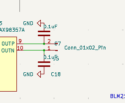

> **❓ Câu hỏi:**
> Với các chân OUTP và OUTN nếu chỉ dùng tụ không thì âm thanh đầu ra có bị dè hay nhiễu không? Nếu có thì em nên khắc phục như thế nào?

---

## 6. 🎤 Khối Mic PDM

### Bố trí

- Đặt **tránh xa LDO, Buck, FPC Connector và AMP** để tránh nhiễu
- Đặt **gần ESP32-S3** để dây DATA và CLK đi ngắn nhất, thẳng nhất

### Thiết kế chi tiết

| Chân | Thiết kế |
|------|----------|
| **VDD** | Ferrite Bead giảm nhiễu + 2 tụ decoupling |
| **SELECT** | Nối thẳng xuống GND |
| **Nguồn** | Cấp 1V8 cho Mic |

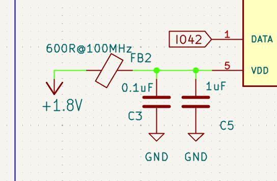
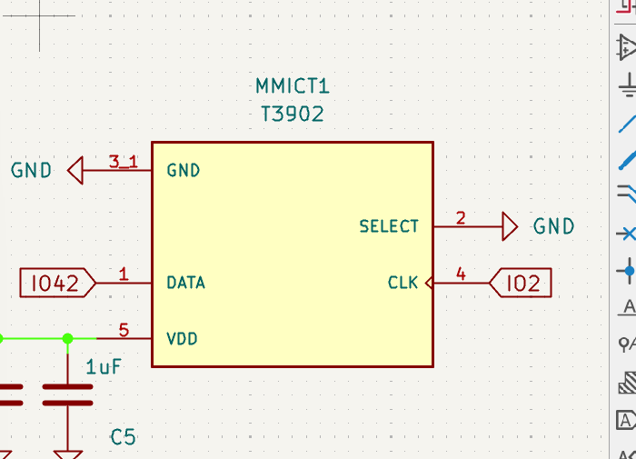
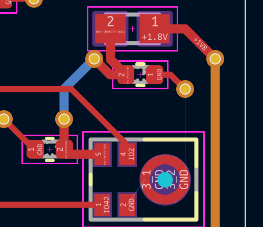
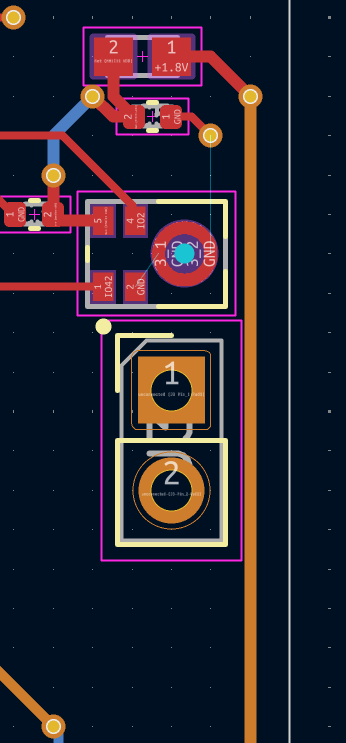

---

## 7. 📐 Tổng Quan Layout PCB

### Lớp Top (Lớp 1)

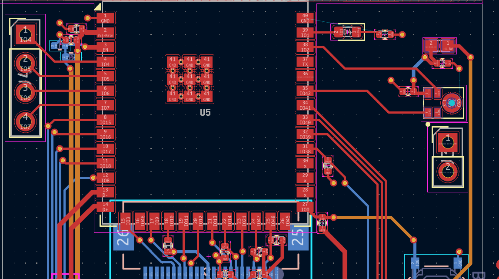

### Lớp Bottom (Lớp 4)

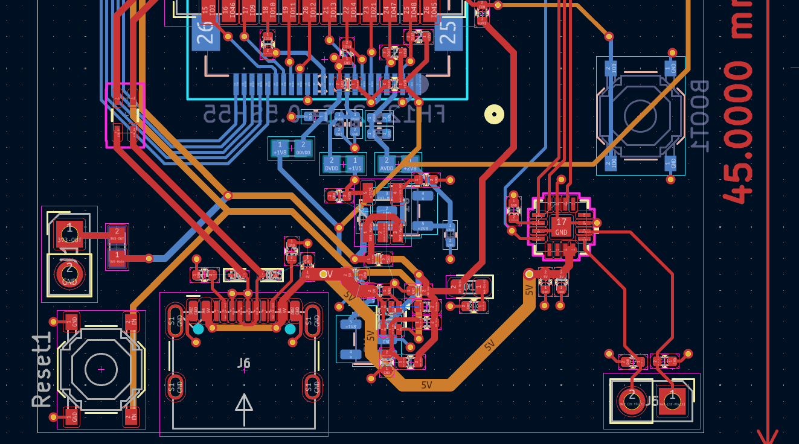

### Các thành phần khác

| Thành phần | Layout |
|------------|--------|
| **Nút Reset** | 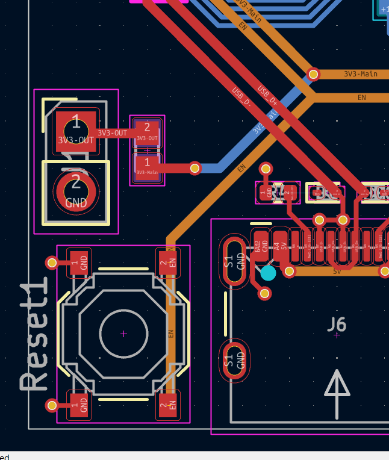 |
| **Nút Boot** | 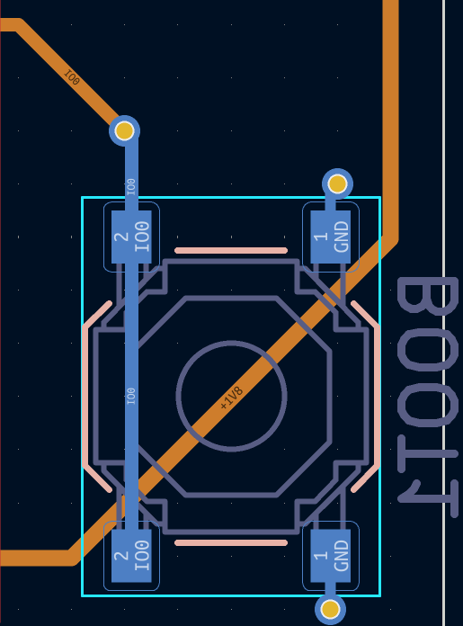 |

### Routing dây Data FPC

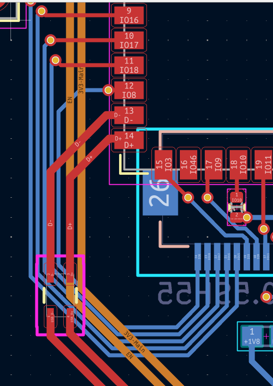

> **Lưu ý:** Các dây data của FPC đi ở **Lớp 4**, còn 2 dây D- và D+ đi ở **Lớp 1**

### Hình ảnh tổng quan

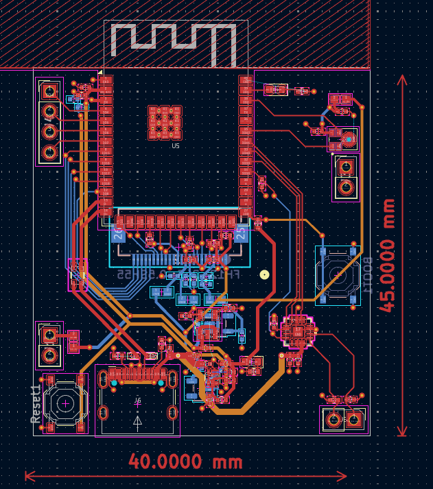

---