# 📒 Danh Sách & Thông Tin Linh Kiện

---

## 🧩 1. Giới Thiệu

Tài liệu này mô tả **toàn bộ các linh kiện** được sử dụng trong project PCB, bao gồm:

- Tên linh kiện & chức năng
- Thông số kỹ thuật chi tiết
- Hình ảnh minh họa
- Link tham khảo trên JLCPCB

---

## 📋 2. Danh Sách Linh Kiện Tổng Quan

| STT | Tên Linh Kiện | Mã JLCPCB |
|:---:|---------------|-----------|
| 1 | ESP32-S3-WROOM Module N16R8 | C2913202 |
| 2 | FPC Connector 24-pin (Camera) | C202112 |
| 3 | Buck Converter TPS62A02 | C5820994 |
| 4 | LDO TLV70028 (2.8V) | C5820994 |
| 5 | LDO RT9193-15GB (1.5V) | C2972229 |
| 6 | PDM Microphone MMICT390200012 | C3171752 |
| 7 | Audio Amplifier MAX98357AETE+T | C910544 |
| 8 | ESD Protection ESD9B3.3ST5G | C96512 |
| 9 | Common Mode Choke DLW21SN900SQ2L | C97856 |
| 10 | USB Type-C 16P | C393939 |

---

## 🧰 3. Chi Tiết Linh Kiện

---

### 🧠 1. ESP32-S3-WROOM Module

| Thông số | Giá trị |
|----------|---------|
| **Chức năng** | Vi điều khiển chính, Wi-Fi, Bluetooth, xử lý camera, audio |
| **Điện áp** | 3.3V |
| **CPU** | Xtensa dual-core 32-bit LX7 @ 240 MHz |
| **SRAM** | 512 kB nội bộ |
| **Flash** | 16 MB (SPI) |
| **PSRAM** | 8 MB ngoài |
| **GPIO** | 45 chân đa năng (ADC, SPI, I2C, UART, PWM, USB OTG) |

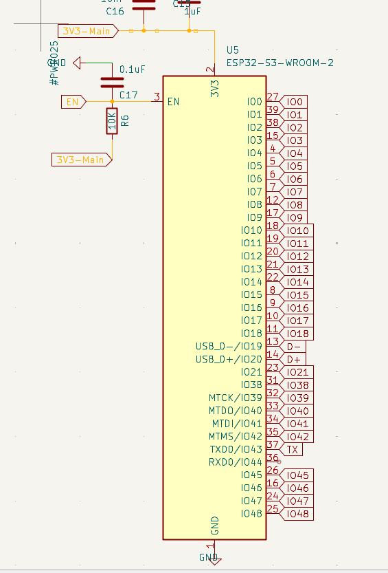

🔗 **Link JLCPCB:** [C2913202](https://jlcpcb.com/partdetail/3198300-ESP32_S3_WROOM_1N16R8/C2913202)

---

### 📷 2. FPC Connector 24-pin (Camera)

| Thông số | Giá trị |
|----------|---------|
| **Chức năng** | Kết nối camera OV2640 / OV5640 / OV3660 |
| **Pitch** | 0.5mm |
| **Tương thích** | OV2640 (2MP), OV5640 (5MP), OV3660 (3MP) |

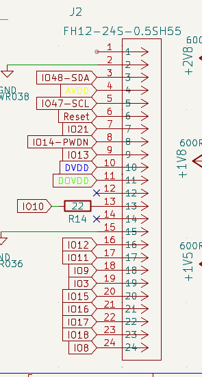
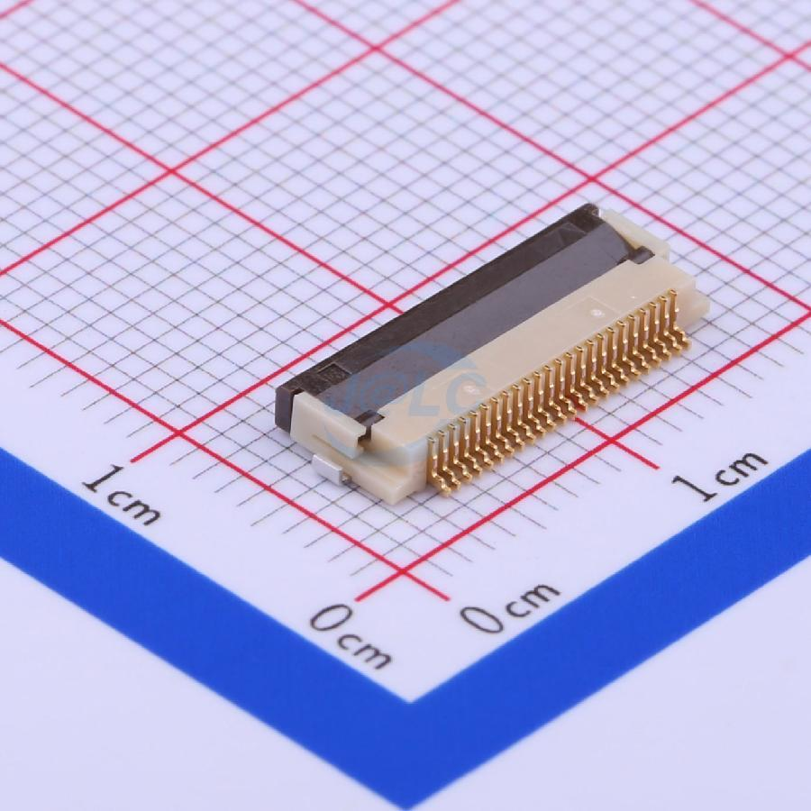

#### Các chân chính:

| Chân | Chức năng |
|------|-----------|
| XCLK | Clock |
| PCLK | Pixel clock |
| HREF | Horizontal reference |
| VSYNC | Vertical sync |
| D0-D7 | Data bits |
| SDA/SCL | I2C config |

🔗 **Link JLCPCB:** [C202112](https://jlcpcb.com/partdetail/HRS_Hirose-FH12_24S_0_5SH_55/C202112)

---

### ⚡ 3. Buck Converter TPS62A02

| Thông số | Giá trị |
|----------|---------|
| **Chức năng** | Hạ áp 5V → 3.3V cho toàn hệ thống |
| **Điện áp vào** | 2.5V - 5.5V |
| **Điện áp ra** | 0.6V - VIN (điều chỉnh được) |
| **Dòng tối đa** | 2A |
| **Tần số chuyển mạch** | 2.4MHz |
| **Quiescent current** | < 23µA |
| **Package** | SOT-563 (DRL-6) |

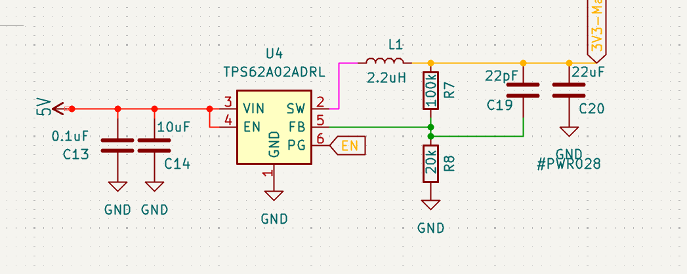
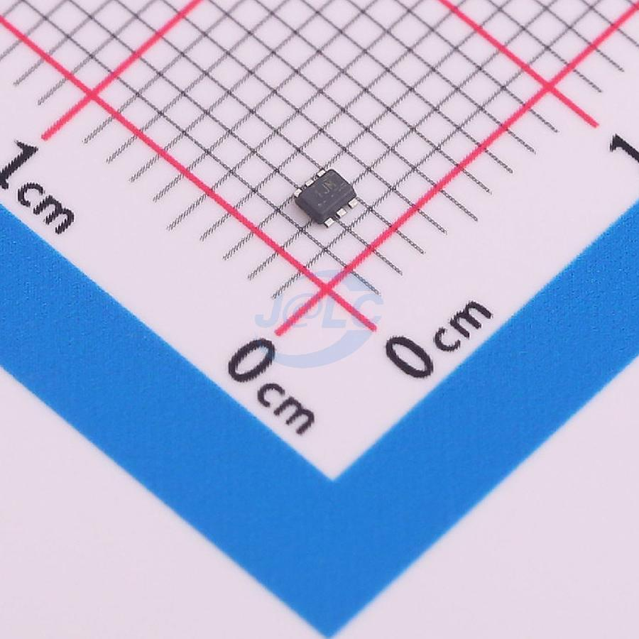

#### Tính năng bảo vệ:

- ✅ Soft-start tích hợp
- ✅ Bảo vệ ngắn mạch (HICCUP mode)
- ✅ Xả output chủ động
- ✅ Thermal shutdown
- ✅ Độ chính xác feedback 1% (0-125°C)
- ✅ Hỗ trợ 100% duty cycle cho dropout thấp

🔗 **Link JLCPCB:** [C5820994](https://jlcpcb.com/parts/componentSearch?searchTxt=C5820994)

---

### 🔋 4. LDO TLV70028 (2.8V)

| Thông số | Giá trị |
|----------|---------|
| **Chức năng** | LDO 200mA, đầu ra cố định 2.8V cho Camera |
| **Điện áp vào** | 2V - 5.5V |
| **Dropout** | 30mV @ 200mA |
| **Quiescent current** | ~3.9µA |
| **PSRR** | 70dB @ 10kHz |
| **Package** | SOT-23-5 (DBV) |
| **Kích thước** | 2.9 x 1.6mm |

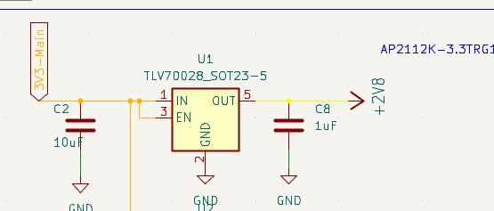
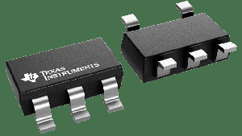

#### Pinout:

| Pin | Chức năng |
|-----|-----------|
| 1 | IN |
| 2 | GND |
| 3 | EN |
| 4 | NC |
| 5 | OUT |

> **Ứng dụng:** LDO hậu Buck TPS62A02 cho rail 2.8V ổn định, cấp nguồn AVDD cho Camera (dòng < 200mA)

🔗 **Link JLCPCB:** [C5820994](https://jlcpcb.com/partdetail/TexasInstruments-TPS62A02ADRLR/C5820994)

---

### 🔋 5. LDO RT9193-15GB (1.5V)

| Thông số | Giá trị |
|----------|---------|
| **Chức năng** | LDO 300mA, đầu ra cố định 1.5V cho Camera |
| **Điện áp vào** | 2.5V - 5.5V |
| **Dropout** | 220mV @ 300mA |
| **Quiescent current** | 90-130µA |
| **PSRR** | 70dB (100Hz) - 50dB (10kHz) |
| **Noise** | < 100µVRMS |
| **Package** | SOT-23-5 (GB/Z00) |

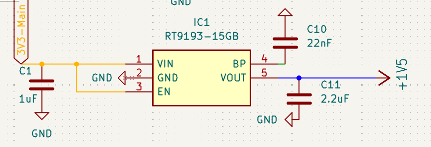
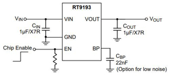
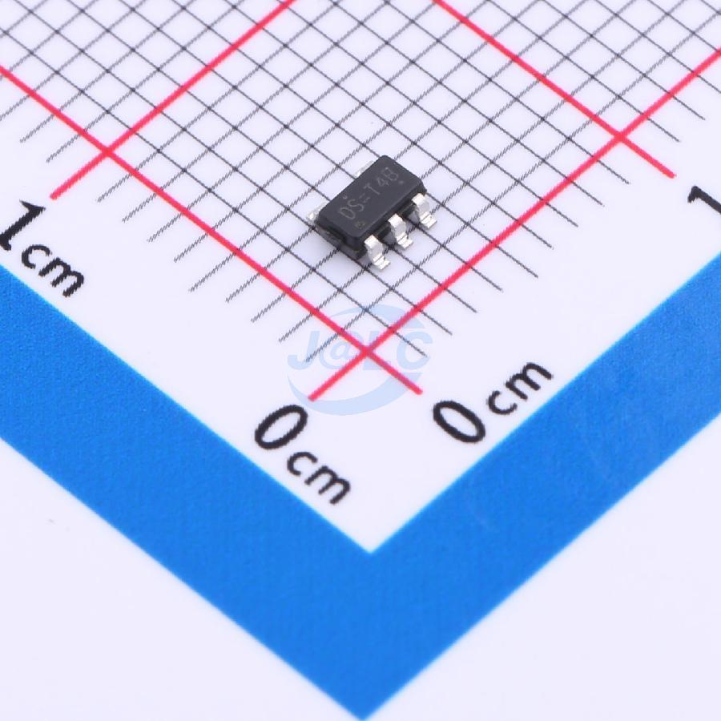

#### Pinout:

| Pin | Chức năng |
|-----|-----------|
| 1 | IN |
| 2 | GND |
| 3 | EN/SHDN |
| 4 | BYP (noise reduction) |
| 5 | OUT |

#### Tính năng:

- ✅ Current limit tích hợp
- ✅ Thermal shutdown (165°C)
- ✅ Shutdown current < 0.01µA
- ✅ Start-up nhanh < 50µs
- ✅ Chỉ cần C_OUT 1µF

> **Ứng dụng:** LDO hậu Buck TPS62A02 cho rail 1.5V ổn định, cấp nguồn DVDD cho Camera

🔗 **Link JLCPCB:** [C2972229](https://jlcpcb.com/partdetail/RichtekTech-RT919315GB/C2972229)

---

### 🎤 6. PDM Microphone MMICT390200012

| Thông số | Giá trị |
|----------|---------|
| **Chức năng** | Thu âm thanh dạng PDM |
| **Điện áp** | 1.65V - 3.63V |
| **Dòng tiêu thụ** | 650µA |
| **Độ nhạy** | -32dB ±1dB @ 94dB SPL |
| **SNR** | 64dB |
| **SPL tối đa** | 120dB |
| **Tần số** | 36Hz - 20kHz |
| **Hướng thu** | Omnidirectional, bottom port |
| **EIN** | 30dBA (low noise) |

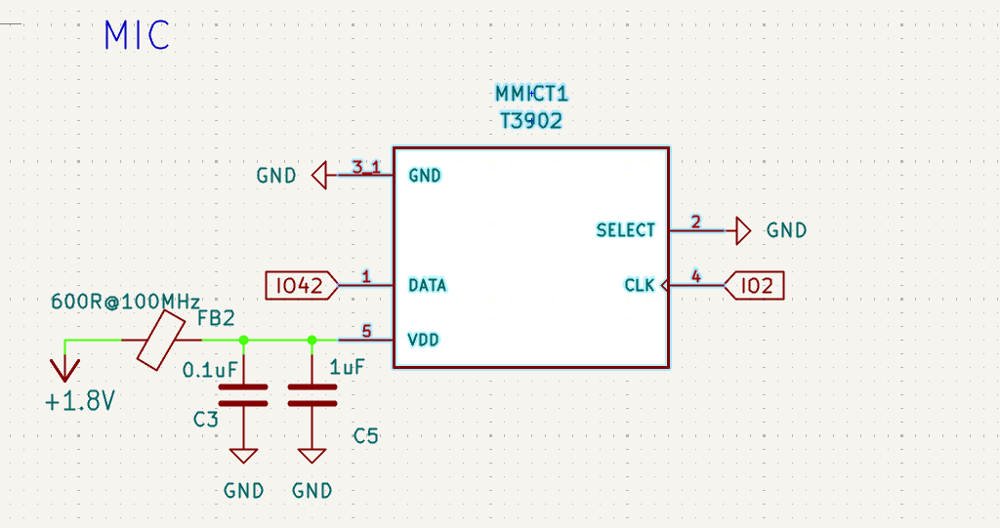
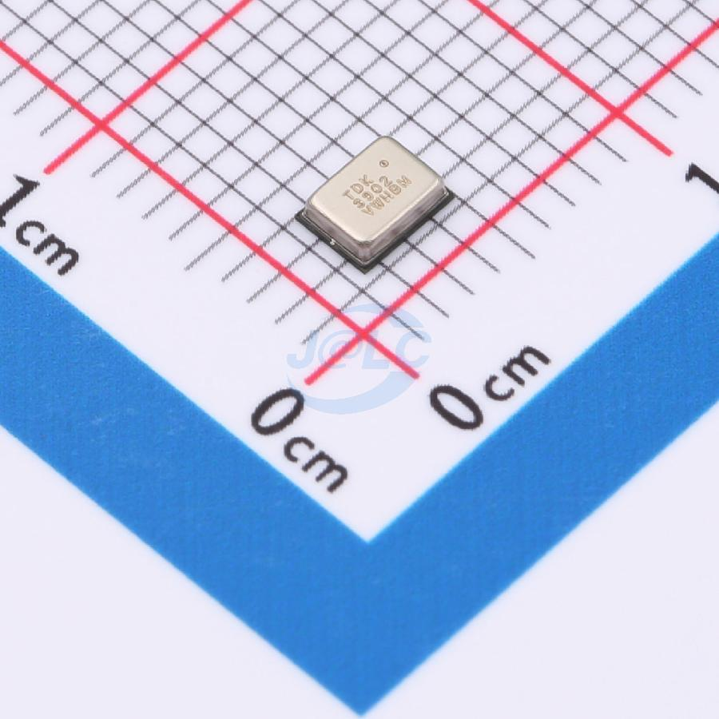

#### Package:

| Thông số | Giá trị |
|----------|---------|
| Kích thước | 3.50 x 2.65 x 0.98mm |
| Lắp đặt | Surface mount, 5 chân |
| Nhiệt độ | -40°C đến 85°C |
| Chuẩn | RoHS compliant |

> **Ứng dụng:** Interface PDM tích hợp với ESP32-S3 I2S/PDM RX cho voice recognition hoặc audio streaming kết hợp camera OV2640

🔗 **Link JLCPCB:** [C3171752](https://jlcpcb.com/partdetail/TDKInvenSense-MMICT390200012/C3171752)

---

### ⚡ 7. ESD Protection Diode ESD9B3.3ST5G

| Thông số | Giá trị |
|----------|---------|
| **Chức năng** | Bảo vệ ESD hai chiều cho đường tín hiệu 3.3V |
| **Breakdown voltage** | 7V max |
| **Clamping voltage** | 11.5V |
| **Capacitance** | 15pF @ 1MHz |
| **Công suất** | 0.3W |
| **Leakage current** | < 50nA |
| **Nhiệt độ** | -55°C đến +150°C (TJ) |
| **Package** | SOD-923 (0.8 x 0.6 x 0.37mm) |

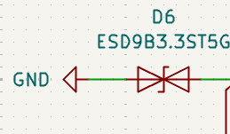
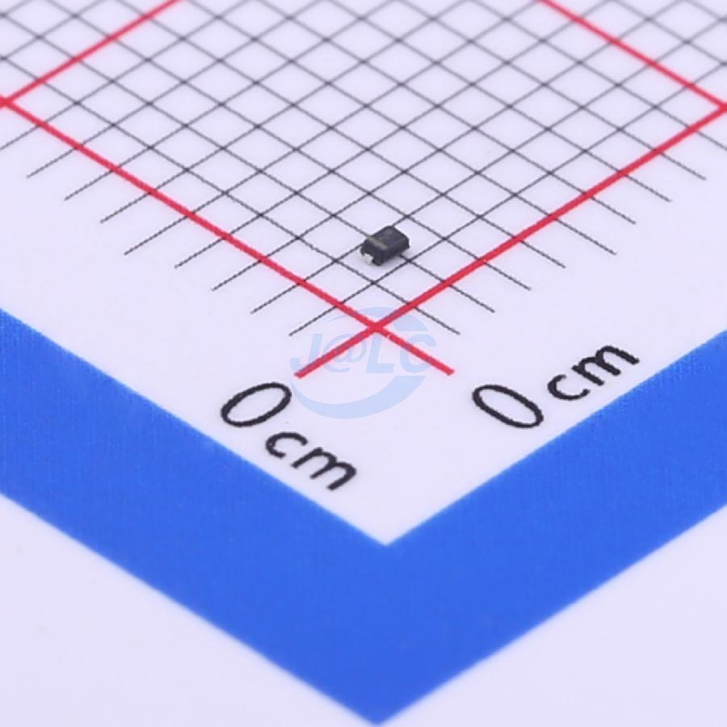

#### Ứng dụng:

- USB-C16PIN (VBUS, D+, D-, CC)
- GPIO ESP32-S3
- I2S audio lines

> **Lắp đặt:** Đặt parallel với đường tín hiệu cần bảo vệ. Không cần hướng pin cụ thể (bidirectional).

🔗 **Link JLCPCB:** [C96512](https://jlcpcb.com/partdetail/onsemi-ESD9B33ST5G/C96512)

---

### � 8. Common Mode Choke DLW21SN900SQ2L

| Thông số | Giá trị |
|----------|---------|
| **Chức năng** | Bộ lọc nhiễu chế độ chung (Common Mode Filter) |
| **Trở kháng** | 90Ω @ 100MHz (±25%) |
| **Dòng định mức** | 330mA |
| **Điện áp định mức** | 50V DC (chịu được 125V) |
| **Điện trở DC** | max 0.35Ω mỗi đường |
| **Cách điện** | min 10MΩ |
| **Package** | SMD 0805 (2.0 x 1.2 x 1.2mm) |

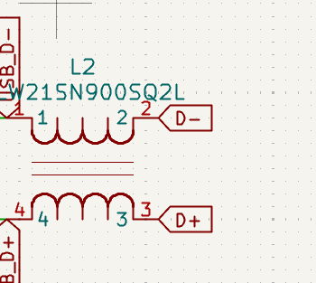

#### Cấu trúc:

- 4 chân SMD (2 line pairs)
- Cấu hình 1 mạch (line 1-2 và line 3-4)
- High coupling coefficient giữ tín hiệu differential nguyên vẹn

> **Ứng dụng:** USB, I2S, high-speed data lines

🔗 **Link JLCPCB:** [C97856](https://jlcpcb.com/partdetail/MurataElectronics-DLW21SN900SQ2L/C97856)

---

### 🔊 9. Audio Amplifier MAX98357AETE+T

| Thông số | Giá trị |
|----------|---------|
| **Chức năng** | Khuếch đại âm thanh Class D cho loa |
| **Điện áp** | 2.5V - 5.5V |
| **Công suất** | 3.2W @ 4Ω/5V (THD+N 10%) |
| **Hiệu suất** | 92% |
| **Noise floor** | 22.8μVRMS |
| **THD+N** | 0.013% @ 1kHz/1W |
| **PSRR** | 77dB @ 1kHz |
| **Quiescent** | 2.4mA |
| **Sample rate** | 8-96kHz |
| **Package** | TQFN-16 (3x3mm) |

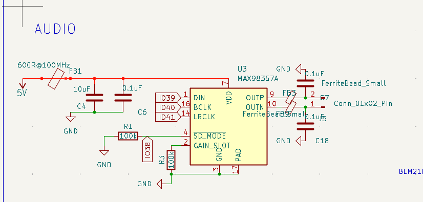

#### Tính năng:

- ✅ Không cần MCLK
- ✅ Gain có thể chọn: 6/12/15dB
- ✅ Filterless output (giảm EMI)
- ✅ Shielded GND riêng cho output stage

#### Pinout chính:

| Chân | Chức năng |
|------|-----------|
| VDD/GND | Nguồn |
| BCLK/LRCLK/DIN | I2S input |
| GAIN_SLOT | Chọn gain |
| OUTP/OUTN | Speaker differential output |
| SD | Shutdown control |

> **Ứng dụng:** Tối ưu cho ESP32-S3 với I2S output

🔗 **Link JLCPCB:** [C910544](https://jlcpcb.com/partdetail/978950-MAX98357AETET/C910544)

---

### 🔌 10. USB Type-C 16P

| Thông số | Giá trị |
|----------|---------|
| **Chức năng** | Cấp nguồn + giao tiếp USB |
| **Điện áp định mức** | 30V |
| **Dòng tối đa** | 3A mỗi chân |
| **Nhiệt độ hoạt động** | -40°C đến +85°C |
| **Độ bền** | 10,000 chu kỳ cắm/rút |
| **Kháng trở tiếp xúc** | ≤ 20mΩ |
| **Cách điện** | > 100MΩ |
| **Lắp ráp** | Surface mount, right angle |

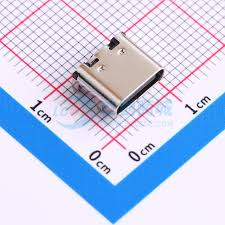
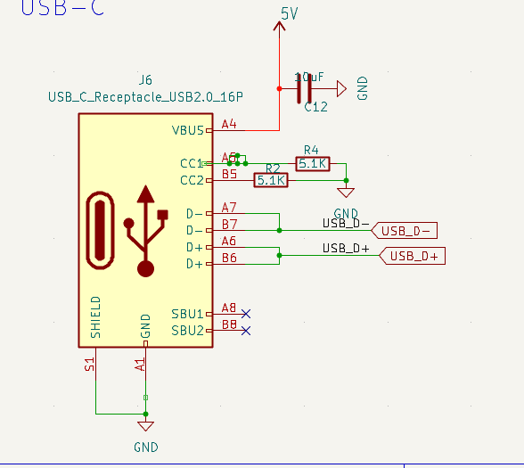

#### Kích thước:

| Thông số | Giá trị |
|----------|---------|
| Kích thước | ~8.94 x 7.35 x 3.16mm |
| Kiểu | Horizontal SMD |
| Pitch | Tiêu chuẩn Type-C |
| Solder heat resistance | 260°C/3s |

> **Lưu ý:** Tích hợp positioning peg giảm misalignment khi reflow. Đạt chuẩn RoHS.

🔗 **Link JLCPCB:** [C393939](https://jlcpcb.com/partdetail/SHOUHAN-TYPEC16PIN/C393939)

---
