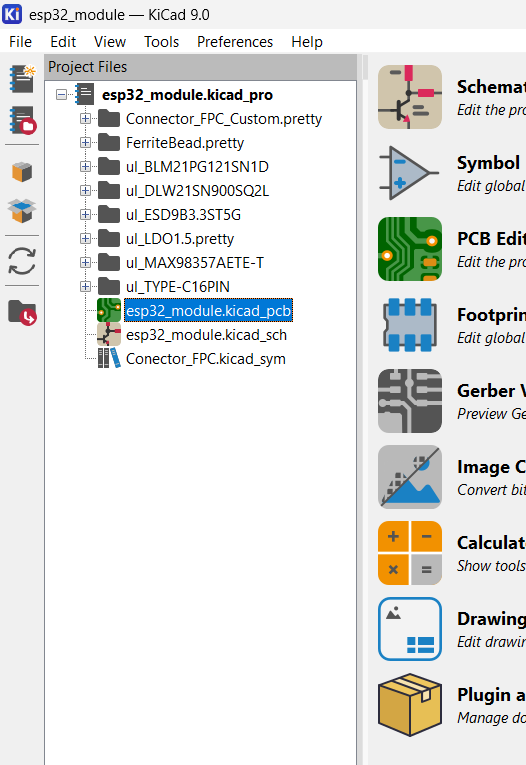
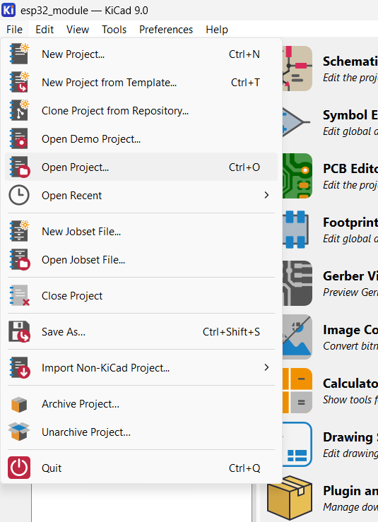
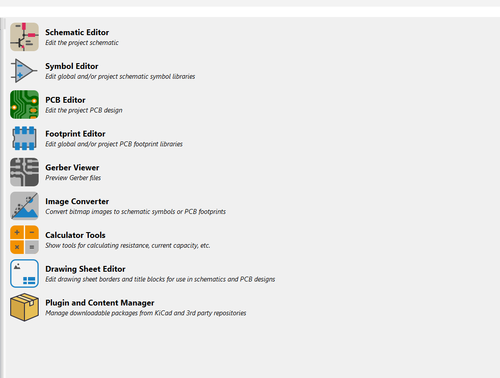
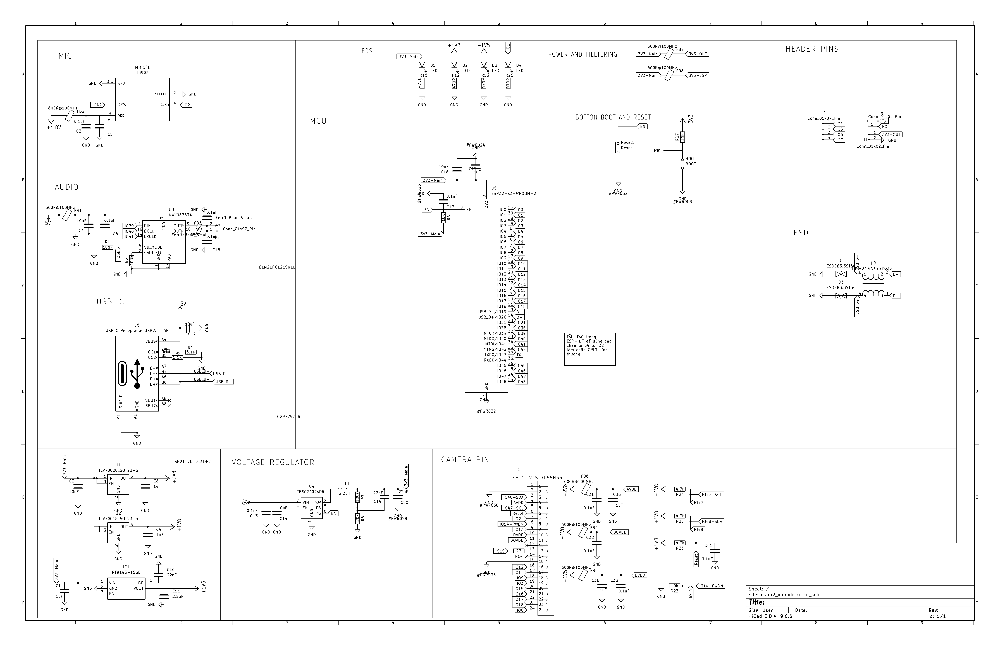
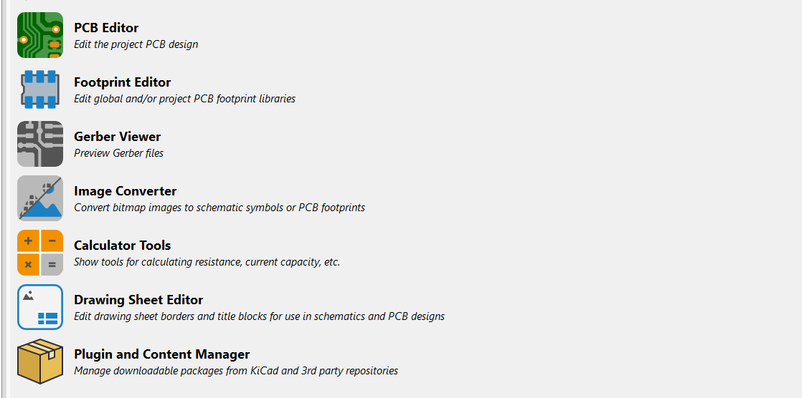

Phần 1 . Hướng dẫn mở dự án kicad 

## 1️⃣ Giới thiệu

Project này được thiết kế bằng **KiCad** và bao gồm:

* **Schematic (sơ đồ nguyên lý)**
* **PCB Layout (mạch in nhiều lớp)**

Tài liệu này hướng dẫn cách mở và xem toàn bộ project bằng **KiCad** trên Windows, Linux hoặc macOS.

---

## 2️⃣ Phần mềm cần cài

Tải và cài đặt :

👉 **KiCad 7 hoặc KiCad 8 hoặc KiCad 9 **

Tải tại:
[https://www.kicad.org](https://www.kicad.org)

> ⚠ Khuyến nghị dùng Kicad 9, phiên bản mà project được tạo ra để tránh lỗi.

---

## 3️⃣ Cấu trúc thư mục project

Sau khi giải nén file ZIP, bạn sẽ thấy thư mục dạng:

```
MyProject/
├── esp32_module.kicad_pro
├── esp32_module.kicad_sch
├── esp32_module.kicad_pcb
├── MyFootprints.pretty
├── ul_myfootprinandsymbol
```

| File         | Chức năng           |
| ------------ | ------------------- |
| `.kicad_pro` | File project chính  |
| `.kicad_sch` | Schematic           |
| `.kicad_pcb` | PCB layout          |
| `.pretty`    | Footprint tùy chỉnh |
| `.kicad_sym` | Symbol tùy chỉnh    |
| `ul_xxxxxxx` | File chứa các footprint và symbol tùy chỉnh   |

---

## 4️⃣ Cách mở project trong KiCad

### Bước 1

Mở **KiCad**



---

### Bước 2

Nhấn **File → Open Project**



---

### Bước 3

Chọn file:

```
MyProject.kicad_pro
```

## 5️⃣ Mở Schematic (Sơ đồ nguyên lý)

Sau khi project mở:

Nhấn **Schematic Editor**



Sau đó sơ đồ nguyên lý sẽ xuất hiện.



---

## 6️⃣ Mở PCB Layout

Trong cửa sổ chính của KiCad:

Nhấn **PCB Editor**



PCB sẽ được mở ra với:

* Các lớp đồng (Top, Bottom, Inner layers)
* Via
* Plane
* Footprint


## Nếu bị lỗi thiếu footprint hoặc symbol

Nếu KiCad báo lỗi như:

> Footprint not found
> Symbol not found

Hãy đảm bảo:

* Thư mục `.pretty`
* File `.kicad_sym`
* File `fp-lib-table`

đang nằm **cùng thư mục với project**

Phần 2 : Thông tin về linh kiên sử dụng , giải thích về sơ đồ nguyên lý và mạch in

Thông tin về linh kiện sử dụng : 
Thầy hãy đọc file LINHKIENSUDUNG.md để biết thông tin chi tiết về linh kiện .

